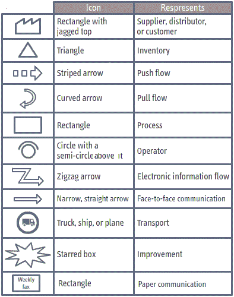

# Applying Value Stream Mapping in Lean Business

### Value Stream Mapping: Core Concepts

#### Value Stream
- Definition: The flow of materials and information that brings a product or service to a customer.
- Importance: Understanding the value stream helps identify waste (e.g., wasted time, unnecessary motion, excess inventory) and improve efficiency.

#### Value Stream Mapping Process
1. **Identify Product/Service**: Choose a product or service to analyze based on factors like defect rates or customer demand.
2. **Create Current-State Map**: Visual representation of the current process. This serves as a baseline for identifying waste.
3. **Assess Current State**: Identify sources of waste (e.g., excess time, inventory).
4. **Develop Future-State Map**: Illustrate the desired state post-improvement, focusing on removing waste.
5. **Implement Improvement Plan**: Execute strategies to transition from current to future state.

### Data Gathering for Current-State Map
- **Tools Required**: Clipboard, stopwatch, question list, possibly a video camera.
- **Key Data Points**:
  - Cycle times
  - Changeover times
  - Uptime
  - Number of operators
  - Inventory levels
- **Process**:
  1. Observe work processes from end to start.
  2. Ask employees about their workflow and information flow.
  3. Document data accurately.

### Creating a Value Stream Map
1. **Map Structure**:
   - Start with customer (right) and supplier (left).
   - Add processes between them (e.g., electrode coating, assembly).
2. **Connect Processes**:
   - Use arrows to indicate material flow.
   - Add operator numbers and process data (cycle times, inventory levels).
3. **Information Flow**:
   - Indicate information flow with arrows, showing how information is communicated.
4. **Lead Time Ladder**: 
   - Represent lead times and value-added times at the bottom of the map.

### Identifying Waste
- Focus on areas that do not add value.
- Types of Waste:
  - **Excess Motion**: Unnecessary movement (e.g., multiple trips for components).
  - **Overproduction**: Producing more than needed.
  - **Excess Inventory**: Unused stock taking up space.
  - **Overprocessing**: Unnecessary steps in a process.
- Use the **5 Whys** technique to find root causes of waste.

### Identifying Process Blocks
- A process block occurs when **cycle time** exceeds **takt time** (time needed to meet customer demand).
- **Cycle Time**: Time taken to complete a task.
- **Takt Time Calculation**:
  \[
  \text{Takt Time} = \frac{\text{Net Operating Time}}{\text{Customer Requirements}}
  \]
- Use bar charts to compare cycle times to takt times and identify bottlenecks.

### Pull Systems in Future State Mapping
- **Definition**: A pull system moves materials only as needed, based on demand, unlike a push system that moves materials forward regardless of demand.
- **Kanban Types**:
  - **Post Kanbans**: Trigger inventory replenishment.
  - **Signal Kanbans**: Visual signals for stock levels.
- **Future-State Features**:
  - Use icons to represent supermarkets, FIFO lanes, and U-shaped cells to optimize flow.

By following these structured steps and understanding the principles of value stream mapping, teams can effectively identify inefficiencies and implement improvements to streamline processes.

